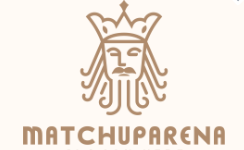

# Match-Up 🎯



A Web3 prediction market mini-app built as a Farcaster Frame. Users can participate in prediction markets for sports, crypto, and custom events.

**🌐 Live App**: [https://matchup-miniapp.vercel.app/](https://matchup-miniapp.vercel.app/)

## Tech Stack

- [MiniKit](https://docs.base.org/builderkits/minikit/overview) - Farcaster Frame integration
- [OnchainKit](https://www.base.org/builders/onchainkit) - Web3 components
- [Base Network](https://base.org) - Coinbase's L2 blockchain
- [Next.js](https://nextjs.org/docs) - React framework
- [Tailwind CSS](https://tailwindcss.com) - Styling

## Getting Started

1. **Clone the repository**:

```bash
git clone <repository-url>
cd matchup-miniapp
```

2. **Install dependencies**:

```bash
npm install
```

3. **Start the development server**:

```bash
npm run dev
```

4. **Open your browser** to `http://localhost:3000`

### Environment Variables (Optional)

For full functionality (Farcaster Frame features, notifications), create a `.env.local` file:

```bash
# Required for Web3 features
NEXT_PUBLIC_ONCHAINKIT_API_KEY=your_api_key
NEXT_PUBLIC_ONCHAINKIT_PROJECT_NAME=Match-Up

# Optional: For Farcaster Frame integration
FARCASTER_HEADER=
FARCASTER_PAYLOAD=
FARCASTER_SIGNATURE=

# Optional: For notifications
REDIS_URL=
REDIS_TOKEN=
```

**Note**: The app works without environment variables for local development and UI testing.

## Features

### 🎲 Prediction Markets

- **Sports**: NBA, NFL, and other sports predictions
- **Crypto**: Bitcoin, Ethereum price predictions
- **Custom**: Community-created prediction events

### 💰 Web3 Integration

- Wallet connection via OnchainKit
- Base network support
- ENS name and avatar display
- ETH balance tracking

### 📱 Mobile-First Design

- Responsive Farcaster Frame
- Bottom navigation tabs
- Reusable UI components
- Clean, modern interface

### 🔔 Notifications

- Redis-backed notification system
- Webhook support for real-time updates
- Frame save/add functionality

## App Structure

### Navigation Tabs

- **Home**: Browse active prediction events
- **My Bets**: View your active predictions
- **Pools**: Explore prediction pools
- **Profile**: Manage your account

### Components

- `MatchUpPage.tsx` - Main prediction events interface
- `MatchUpComponents.tsx` - Reusable UI components
- `LayoutComponents.tsx` - Navigation and layout

### Development

- Add new prediction categories in `MatchUpPage.tsx`
- Customize UI components in `MatchUpComponents.tsx`
- Update theme in `theme.css`

## Local Development

The app runs locally without any setup beyond `npm install` and `npm run dev`. You can:

- Browse prediction events
- Test navigation between tabs
- View UI components and styling
- Test wallet connection UI (requires OnchainKit API key for full functionality)
